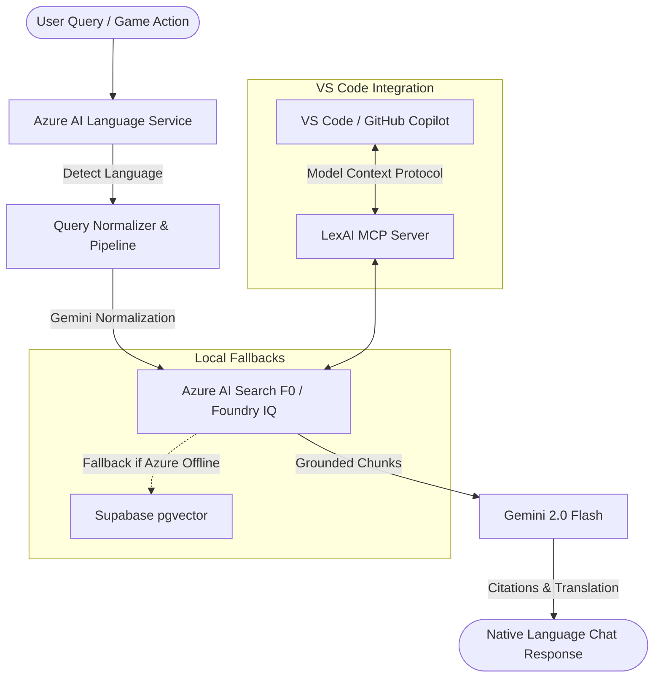

# LexAI — Multilingual Legal Aid for Indian Citizens

> **Free, instant, multilingual legal aid for Indian citizens — delivering civic awareness through interactive play and grounded conversation.**
> Built for the Microsoft AI Skills Fest Hackathon — Battle #1: Creative Apps with GitHub Copilot.

---

## 📖 The Problem
Over **50 crore people** in India face legal disputes or rights violations every year. However, fewer than 10% can afford legal representation. The remaining 90% (such as daily wage workers, online shoppers, domestic helpers, and college students) are left vulnerable simply because they do not know what the law says or how to act on it.

Legalese is complex, official documentation is almost exclusively in English, and legal systems are intimidating. There is a critical lack of an accessible, safety-first bridge between everyday problems and the statutes that resolve them.

---

## 🚀 What LexAI Does

LexAI bridges this gap through a unified product ecosystem with three standout features:

### 1. Legal Aid Chat Assistant
Citizens describe their problems in plain, natural language (including messy multilingual code-mixing like Hindi, Kannada, Hinglish, and Kanglish). LexAI instantly:
- Detects the input language.
- Normalizes the query into clean English legal terminology.
- Performs vector retrieval against official legislation.
- Explains their rights in simple, native-tongue terms, fully grounded in verified legislation with precise section citations and a District Legal Services Authority (DLSA) fallback.

### 2. Legal Rights Simulator (Choose-Your-Own-Adventure)
An interactive story game where citizens play through real Indian legal scenarios:
- **Scenario 1: Withheld Wages** (Payment of Wages Act, 1936) — Ravi, a factory worker in Mangaluru.
- **Scenario 2: The Defective Refund** (Consumer Protection Act, 2019) — Priya, an online laptop buyer.
- **Scenario 3: Cyber Harassment** (IT Act, 2000) — Aisha, a college student facing cyber bullying.
Players choose paths, see immediate legal consequences, gain/lose legal knowledge points, and read AI explanations grounded in retrieved acts. When finished, they can seamlessly transition to the Chat Assistant with their scenario preloaded.

### 3. LexAI MCP Server (VS Code Extension)
Exposes LexAI's legal knowledge base directly inside VS Code via the **Model Context Protocol (MCP)**. Developers using **GitHub Copilot Chat** can query Indian legislation live while writing code. LexAI goes beyond just using Copilot — it extends Copilot's capabilities.

---

## 🛠️ Microsoft Ecosystem & AI Integration

LexAI integrates multiple enterprise-grade cloud services to deliver premium, reliable performance at zero cost:



- **Microsoft Foundry IQ & Azure AI Search (F0 Free Tier)**: Indexes text-based legislation PDFs (`Payment of Wages Act 1936`, `Consumer Protection Act 2019`, `IT Act 2000`) and serves as the primary vector retrieval layer.
- **Azure AI Language Service (F0 Free Tier)**: Detects user language dynamically (supporting Hindi, Kannada, and English) to govern subsequent responses.
- **Gemini 2.0 Flash (Free Tier)**: Used as the core intelligence layer for multilingual query normalization, choice grading, reasoning over legal documents, and generating cited explanations.
- **Supabase pgvector (Free Tier)**: Integrates as a local/development database and fallback retrieval source to ensure 100% demo uptime.

---

## 🗣️ Multilingual Pipeline
Because Indian citizens rarely communicate in pure legal English or formal Hindi/Kannada, LexAI handles code-mixed input seamlessly:

1. **Language Detection**: `azure-ai-textanalytics` detects the dominant language (e.g. `'hi'` or `'kn'`).
2. **Query Normalization**: Gemini normalizes messy input (e.g. `"boss ne 3 mahine se salary nahi di"` or `"salary siglilla"`) into standard English (e.g. `"Employer has not paid salary for 3 months"`).
3. **Index Retrieval**: Queries the English-only Azure AI Search index using the normalized text.
4. **Reasoning & Native Output**: Gemini reads the retrieved English laws, reasons over them, and answers the citizen in their detected language (Hindi/Kannada/English) with citations.

---

## 🔒 Safety-First Design
To protect users from receiving wrong legal advice, LexAI implements strict architectural boundaries:
- **Clarifying Questions**: If key context (e.g. state, employment status) is missing, the assistant asks exactly one clarifying question before returning answers.
- **Required Citations**: Every legal statement must cite an official act and section (e.g. `[Payment of Wages Act, 1936, Section 15]`). If no relevant chunks are found, it defaults to the DLSA.
- **Scope Limitations**: Explicitly filters out out-of-scope legal domains (e.g. criminal defense, taxation, family disputes, property disputes) and redirects them.
- **DLSA Fallback**: Answers end with a standard notice directing users to contact their District Legal Services Authority (DLSA) for free representation.

---

## 🤖 GitHub Copilot Integration

GitHub Copilot acted as the lead pair-programmer during development:
- **Inline Suggestions**: Used to implement FastAPI routes, Pydantic validation schemas, Pydantic Settings configurations, and rate-limiting backoffs.
- **Copilot Chat**: Utilized for debugging the standard input/output (stdio) streams of the MCP server, defining the JSON-RPC interface, and generating VS Code configuration overrides.
- **MCP Extension**: Allows Copilot to use tools like `search_laws` and `explain_law_section` directly during development and user demos.

---

## 💻 How to Run Locally

### Prerequisites
- Python 3.11+
- Node.js 18+
- Supabase account (if testing fallback Vector DB)

### 1. Configuration (`.env`)
Create a `.env` file in the root directory:
```env
# Azure Search Credentials
AZURE_SEARCH_ENDPOINT=https://lexai-search.search.windows.net
AZURE_SEARCH_KEY=your_azure_search_api_key
AZURE_SEARCH_INDEX=legal-knowledge

# Azure Language Service Credentials
AZURE_LANGUAGE_ENDPOINT=https://lexai-language.cognitiveservices.azure.com
AZURE_LANGUAGE_KEY=your_azure_language_api_key

# Gemini API Key
GEMINI_API_KEY=your_gemini_api_key

# Supabase Fallback (Optional)
SUPABASE_URL=https://your-project.supabase.co
SUPABASE_SERVICE_KEY=your-supabase-key

# App config
ENVIRONMENT=development
MAX_RETRIEVED_CHUNKS=5
RETRIEVER_TYPE=foundry # Set to 'supabase' to test local fallback
```

### 2. Run Backend (FastAPI)
```bash
cd backend
pip install -r requirements.txt
uvicorn main:app --reload --port 8000
```

### 3. Run Frontend (React + Vite)
```bash
cd frontend
npm install
npm run dev
```

### 4. Run & Load the MCP Server in VS Code
Add the configuration block below to your VS Code user settings or save it in the workspace folder under `.vscode/mcp.json`:
```json
{
  "mcp.servers": {
    "lexai-helper": {
      "command": "python",
      "args": ["c:/Users/amish/lexai/backend/mcp_server.py"]
    }
  }
}
```
Open Copilot Chat inside VS Code, ask:
> *"How does the Payment of Wages Act protect me from delayed salary? Ask LexAI helper."*
Copilot will trigger the `search_laws` tool and provide a grounded legal response.

---

## 🔗 Deployment

- **Frontend**: Deployed to Vercel (React + Tailwind client).
- **Backend**: Deployed to Render.com (FastAPI server).
- **Knowledge Base**: Hosted on Microsoft AI Foundry / Azure AI Search.

---

## Team

| Name | Role |
|------|------|
| Amisha Josna D'Souza | Lead Developer, System Architect |

---

*LexAI — Knowledge is the first step to justice.*
