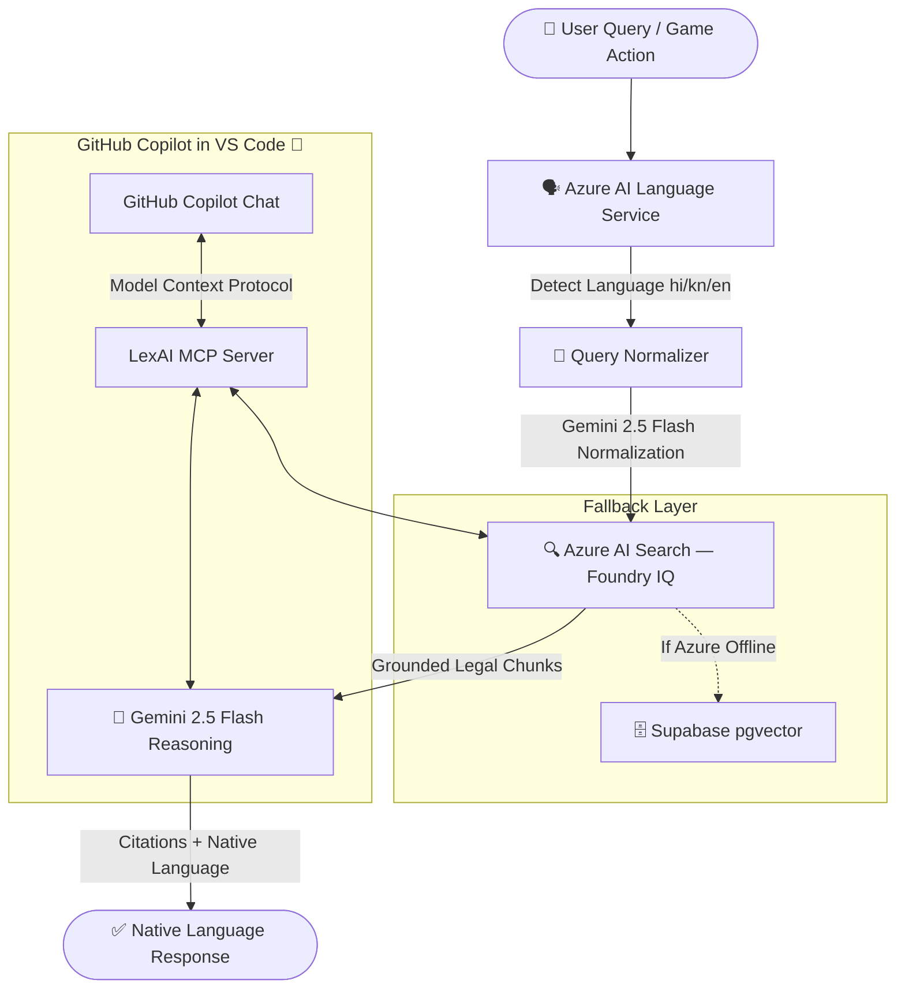
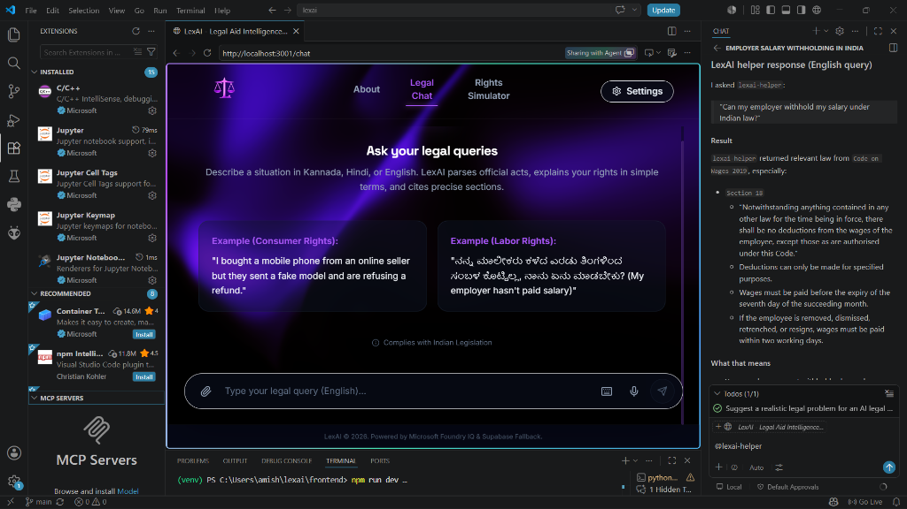

<div align="center">

# ⚖️ LexAI
## Multilingual Legal Aid for 800M+ Indian Citizens

**_Millions in India lose wages, refunds, and rights — not because laws don't protect them, but because they can't understand those laws._**

LexAI bridges the gap between Indian citizens and the law using **AI-powered legal intelligence**, **multilingual understanding**, and **gamified civic education** — all grounded in verified legislation via the Microsoft Azure ecosystem.

<br/>

[](https://github.com/features/copilot)
[](https://azure.microsoft.com/en-us/products/search)
[](https://azure.microsoft.com/en-us/products/ai-services/ai-language)
[](https://code.visualstudio.com/)

<br/>

> 🏆 **Microsoft AI Skills Fest Hackathon — Battle #1: Creative Apps with GitHub Copilot**

</div>

---

## 📖 The Problem

> Over **50 crore (500M+) people** in India face legal disputes or rights violations every year.
> Fewer than **10%** can afford legal representation.

The rest - daily wage workers, online shoppers, domestic helpers, college students — are left vulnerable because:

- 🔤 Legal language is written in complex, inaccessible English
- 🌐 Citizens speak Hindi, Kannada, and dozens of regional languages
- 💸 Legal counsel costs ₹5,000–₹50,000 per consultation
- 😰 Legal systems feel intimidating and opaque

**There is no accessible bridge between everyday problems and the statutes that protect ordinary citizens.**

---

## ✨ Why LexAI Stands Out

| Feature | What It Means |
|---|---|
| 🌐 **Multilingual by Design** | Handles Hindi, Kannada, Hinglish, Kanglish, and Devanagari/Kannada script natively |
| ⚖️ **Grounded Legal Citations** | Every answer cites exact Act + Section — no hallucinations |
| 🎮 **Gamified Legal Education** | 5-stage choose-your-own-adventure simulator with AI grading |
| 🤖 **Dynamic AI Scenarios** | Gemini generates full legal game trees from plain-text dispute descriptions |
| 🔌 **GitHub Copilot MCP Extension** | LexAI becomes a Copilot capability — not just a Copilot-built app |
| ☁️ **Azure-Powered Intelligence** | Foundry IQ + Azure AI Language + Azure-native production architecture |

---

## 🚀 Three Core Features

### 1. 🤖 Legal Aid Chat Assistant

Citizens describe their problem in any language — messy, emotional, incomplete — and LexAI:

1. **Detects language** → Azure AI Language Service (Hindi / Kannada / English)
2. **Normalizes query** → Gemini converts `"boss ne salary nahi di"` to `"Employer has not paid salary for 3 months"`
3. **Retrieves law** → Azure AI Search (Foundry IQ) returns exact Act sections
4. **Explains rights** → Gemini reasons over retrieved law and responds in the user's language with mandatory citations
5. **DLSA fallback** → If no law matches, redirects to District Legal Services Authority

**Live tested examples:**

| Input | Language | Retrieved Law |
|---|---|---|
| `"mujhe 3 mahine se salary nahi mili"` | Hindi | Code on Wages 2019, §15, §17, §18 |
| `"ನನ್ನ ಮಾಲೀಕರು ಸಂಬಳ ಕೊಟ್ಟಿಲ್ಲ"` | Kannada | Code on Wages 2019, §15, §18 |
| `"defective laptop refund denied"` | English | Consumer Protection Act 2019, §15, §82 |

---

### 2. 🎮 Legal Rights Simulator

An interactive **choose-your-own-adventure** game where citizens play through real Indian legal disputes across **5 structured stages**:

```
Stage 1: Discovery → Stage 2: Complication → Stage 3: Escalation → Stage 4: Legal Action → Stage 5: Resolution
```

**Two Modes:**

**🗂️ Category Simulator** — Pre-verified, curated scenarios:
- 🏭 *Withheld Wages* — Ravi, factory worker | Code on Wages, 2019
- 🛒 *Defective Product Refund* — Priya, online shopper | Consumer Protection Act, 2019
- 💻 *Cyber Harassment* — Aisha, college student | IT Act, 2000

**✨ Custom AI Simulator** — Describe any legal dispute → Gemini dynamically generates a full 5-stage game tree

**End-Game Analytics Dashboard (3-Column):**
- 📊 Score breakdown + Rank badge + XP progression bar
- 📈 Level-wise performance bars + Correct / Risky / Illegal move metrics
- 🏛️ Key Legal Takeaways timeline + Key Laws Explored chips

---

### 3. 🔌 LexAI MCP Server (VS Code + GitHub Copilot)

LexAI doesn't just use GitHub Copilot to write code - **it becomes a Copilot capability**.

The `FastMCP`-based server exposes LexAI's full legal intelligence pipeline inside VS Code:

```python
search_laws(query, limit)         # Azure AI Search → ranked law sections
explain_law_section(act, section) # Gemini → plain language explanation
legal_expert_chat()               # Primes Copilot as Indian Legal Aid expert
```

**Demo query in Copilot Chat:**
> *"How does the Consumer Protection Act handle defective products? Ask LexAI helper."*

Copilot invokes `search_laws` → Azure AI Search → grounded, cited legal answer in real-time.

---

## 🛠️ System Architecture



---

## 💙 Why Microsoft Technologies Matter

### Azure AI Search — Microsoft Foundry IQ
> **Prevents hallucination. Grounds every answer in verified Indian law.**

Without Foundry IQ, Gemini guesses. With Foundry IQ, Gemini reads the actual legislation.

```
Without Foundry IQ:   User question → Gemini → (possibly hallucinated) answer
With Foundry IQ:      User question → Azure Search → real law sections → Gemini → cited answer
```

### Azure AI Language Service
> **Production-grade multilingual detection — supporting Devanagari, Kannada script, and code-mixed Indian speech.**

Standard language libraries fail on Hinglish. Azure AI Language handles it correctly.

### GitHub Copilot
> **Used throughout development AND embedded as an MCP capability.**

- Wrote FastAPI routes, Pydantic schemas, RAG pipeline, simulator game logic, React UI
- LexAI's MCP server makes Copilot smarter about Indian law — judges in VS Code can query statutes live

### Model Context Protocol (MCP)
> **LexAI extends Copilot, not just uses it.**

Every other hackathon team *builds with Copilot*. LexAI *becomes a Copilot capability*.

---

## 🖥️ UI Preview

> Below are key UI screens showcasing LexAI's premium dark-theme interface.

| Screen | Preview |
|---|---|
| 🏠 Home / Landing |  |
| 💬 Legal Chat |  |
| 🎮 Rights Simulator |  |
| 📊 End Dashboard |  |
| 🔌 MCP in VS Code |  |

---

## ⏱️ 3-Minute Demo Flow

| Step | Action | What to Show |
|---|---|---|
| **1** | Open LexAI | Dark glassmorphism landing page |
| **2** | Type: `"mujhe 3 mahine se salary nahi mili"` | Multilingual Hindi input |
| **3** | See response | Hindi reply with Code on Wages §17 citation |
| **4** | Navigate to Rights Simulator | Category selection screen |
| **5** | Select "Defective Refund" → play 5 stages | Double-click to confirm choices |
| **6** | Reach End Dashboard | Score, rank badge, Key Legal Takeaways timeline |
| **7** | Open VS Code → Copilot Chat | Ask legal question via LexAI MCP tool |

---

## 💻 Run Locally

### Prerequisites
- Python 3.11+ · Node.js 18+

### 1. Configure `.env`
```env
AZURE_SEARCH_ENDPOINT=https://your-search.search.windows.net
AZURE_SEARCH_KEY=your_azure_search_api_key
AZURE_SEARCH_INDEX=legal-knowledge-index
AZURE_LANGUAGE_ENDPOINT=https://your-language.cognitiveservices.azure.com
AZURE_LANGUAGE_KEY=your_azure_language_api_key
GEMINI_API_KEY=your_gemini_api_key
RETRIEVER_TYPE=foundry
```

### 2. Run Backend
```bash
cd backend
pip install -r requirements.txt
uvicorn main:app --reload --port 8000
```

### 3. Run Frontend
```bash
cd frontend
npm install
npm run dev
# → http://localhost:3000
```

### 4. Register MCP Server in VS Code
Save as `.vscode/mcp.json`:
```json
{
  "servers": {
    "lexai-helper": {
      "type": "stdio",
      "command": "python",
      "args": ["./backend/mcp_server.py"]
    }
  }
}
```
Open **GitHub Copilot Chat** → ask any Indian legal question → LexAI answers with live Azure retrieval.

---

## ☁️ Production Architecture (Azure-Native)

| Layer | Platform |
|---|---|
| 🌐 Frontend | **Azure Static Web Apps** |
| ⚙️ Backend | **Azure App Service** |
| 🔍 Knowledge Base | **Azure AI Search (Foundry IQ)** |
| 🗣️ Language Detection | **Azure AI Language Service** |
| 🤖 LLM | Gemini 2.5 Flash |
| 🗄️ Fallback DB | Supabase pgvector |

> 💡 Current rapid-iteration deployment uses Vercel (frontend) + Render.com (backend).
> Production architecture is fully Azure-native for enterprise scalability and Microsoft ecosystem alignment.

---

## 🔭 Future Scope

| Feature | Impact |
|---|---|
| 🎙️ **Voice Assistant** | Citizen speaks in Hindi/Kannada — LexAI speaks back with legal rights |
| 📄 **OCR Legal Document Reader** | Upload any court notice or contract — LexAI explains it |
| 🌏 **More Indian Languages** | Tamil, Telugu, Marathi, Bengali, Gujarati |
| 📱 **Mobile App** | React Native with offline legal reference |
| 🏛️ **Government Integration** | Plug into National Legal Services Authority (NALSA) APIs |
| 📊 **Legal Analytics Dashboard** | Anonymized insights on most common rights violations by region |

---

## 🛠️ Full Tech Stack

| Layer | Technology |
|---|---|
| Frontend | React 18 + TypeScript + Vite + Tailwind CSS |
| Backend | Python 3.11 + FastAPI |
| LLM | Gemini 2.5 Flash |
| Vector Search | **Azure AI Search — Foundry IQ** |
| Language Detection | **Azure AI Language Service** |
| MCP | FastMCP (stdio transport) |
| Copilot Integration | **GitHub Copilot Chat + MCP in VS Code** |
| Fallback DB | Supabase pgvector |
| Dev AI Pair Programmer | **GitHub Copilot** |

---

## 👤 Team

| Name | Role |
|------|------|
| **Amisha Josna D'Souza** | Lead Developer & System Architect |

---

<div align="center">

**⚖️ LexAI — Knowledge is the first step to justice.**

*Built with 💙 for India's 800M+ unrepresented citizens*

</div>
